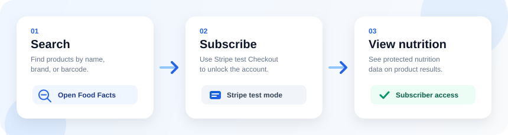
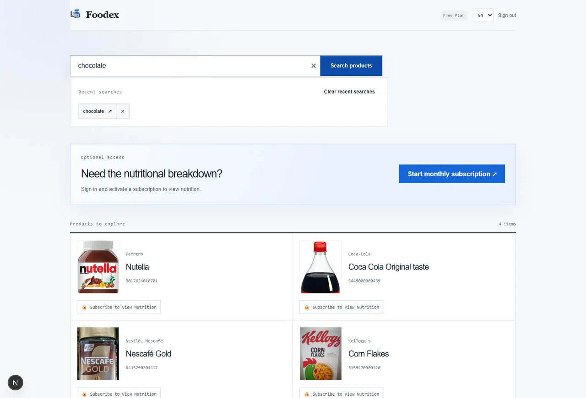
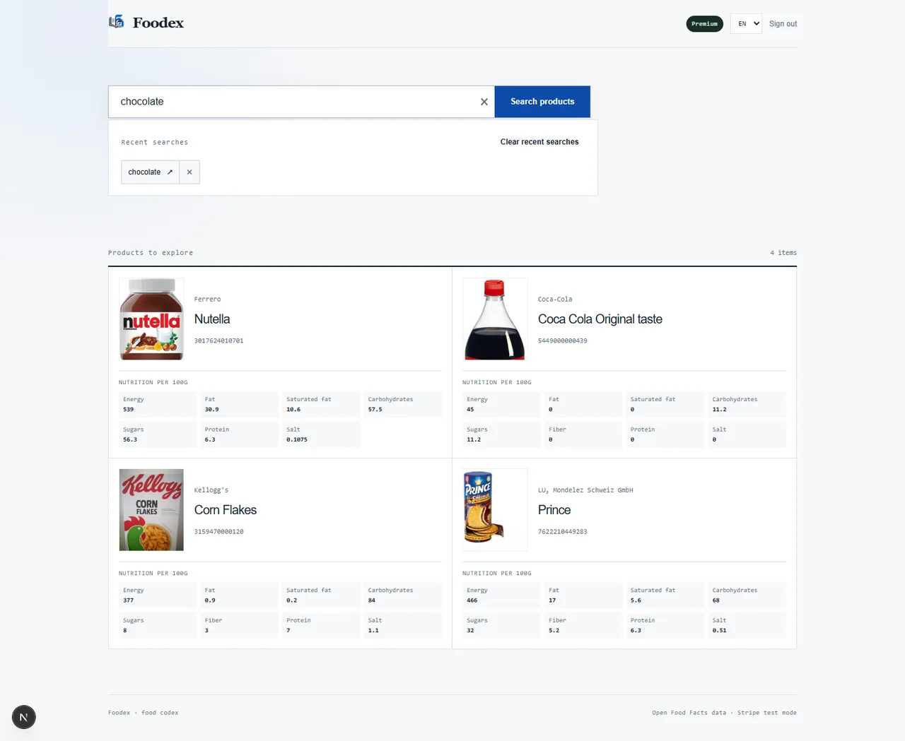
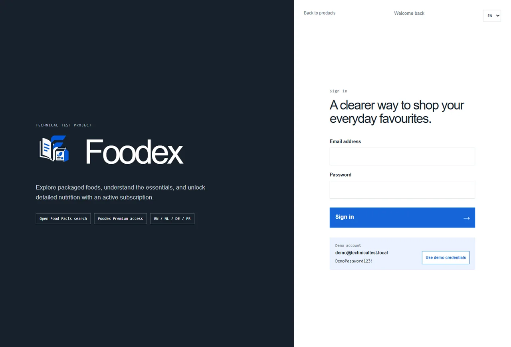

<p align="center">
  
</p>

<h1 align="center">Foodex</h1>

<p align="center">
  Search packaged food, save your recent queries, and unlock detailed nutrition data with a Stripe test-mode subscription.
</p>

<p align="center">
  
</p>

Foodex—short for **food codex**—is a focused full-stack technical assignment for finding packaged food through Open Food Facts. Public visitors can search and view a product's name, brand, image, and barcode. A signed-in demo user can save recent searches and start a Stripe test-mode monthly subscription; only an active or trialing subscriber receives detailed nutrition data from the backend.

## Preview

<table>
  <tr>
    <td width="50%" align="center">
      
      <br />
      <sub>Search results with subscription-gated nutrition</sub>
    </td>
    <td width="50%" align="center">
      
      <br />
      <sub>Active subscriber view with nutrition details</sub>
    </td>
  </tr>
  <tr>
    <td colspan="2" align="center">
      
      <br />
      <sub>Dedicated sign-in page with demo credentials and Foodex branding</sub>
    </td>
  </tr>
</table>


## Features

- Responsive Next.js search interface in English, Dutch, German, and French.
- Locale-aware Open Food Facts product names with English and source-name fallbacks.
- Search-first interface powered by Open Food Facts Search-a-licious, with 20 ranked results per page and simple previous/next navigation.
- Fifteen-minute in-memory search cache, concurrent-request coalescing, one controlled retry, and stale-cache recovery during temporary provider failures.
- Dedicated `/login` route for the environment-configured demo account, using a signed, HttpOnly session cookie.
- Recent searches persisted in MySQL through Prisma.
- Stripe-hosted monthly subscription Checkout in test mode.
- Signed, idempotent webhook processing and server-enforced nutrition entitlement.
- Focused Vitest unit/integration tests and Playwright browser tests.

## Technology

| Area         | Technology                                     |
| ------------ | ---------------------------------------------- |
| Web          | Next.js 16, React 19, TypeScript, Tailwind CSS |
| API          | Express 5, TypeScript, Zod                     |
| Data         | Prisma 6, MySQL 8                              |
| Product data | Open Food Facts API                            |
| Payments     | Stripe Checkout and signed webhooks            |
| Tests        | Vitest, Supertest, and Playwright              |

## Repository layout

```text
apps/web        Next.js frontend and Playwright tests
apps/api        Express API, Prisma schema, migration, seed, and API tests
packages/shared Shared locale and product contracts
docs            Architecture notes, ADRs, and submission checklist
```

## Prerequisites

- Node.js 22 or later and npm 11 or later.
- MySQL 8 or Docker Desktop for the included MySQL service.
- A Stripe account with test-mode keys and a recurring monthly Price.
- Google Chrome for the Playwright suite.

## Local setup

### 1. Install and configure

```powershell
npm install
Copy-Item .env.example .env
```

Set the following values in the root `.env` file:

| Variable                  | Purpose                                                       |
| ------------------------- | ------------------------------------------------------------- |
| `DATABASE_URL`            | Prisma connection string for MySQL                            |
| `API_PORT`                | Express port; defaults to `4000`                              |
| `WEB_ORIGIN`              | Browser origin allowed by Express CORS                        |
| `NEXT_PUBLIC_API_URL`     | Public API URL used by the browser                            |
| `STRIPE_SECRET_KEY`       | Stripe test secret key beginning with `sk_test_`              |
| `STRIPE_WEBHOOK_SECRET`   | Webhook signing secret beginning with `whsec_`                |
| `STRIPE_MONTHLY_PRICE_ID` | Active recurring test Price beginning with `price_`           |
| `DEMO_EMAIL`              | Seeded demo account email                                     |
| `DEMO_PASSWORD`           | Demo-only password displayed on the login screen              |
| `SESSION_SECRET`          | Random string of at least 32 characters used to sign sessions |
| `PLAYWRIGHT_CHROME_PATH`  | Local Chrome executable used by Playwright                    |

Never commit `.env`; only `.env.example` belongs in Git.

### 2. Start and seed MySQL

```powershell
docker compose up -d mysql
docker compose ps
npm run db:generate
npm run db:migrate
npm run db:seed
```

Wait for `technical-test-mysql` to become healthy before running the Prisma commands. Run the seed again if `DEMO_EMAIL` changes.

### 3. Configure Stripe test mode

1. In the Stripe Dashboard, enable test mode and create a product with an active recurring monthly Price.
2. Add its secret key and Price ID to `.env`.
3. Install and authenticate the Stripe CLI, then forward events:

```powershell
stripe login
stripe listen --forward-to localhost:4000/api/stripe/webhook
```

Copy the listener's `whsec_...` value to `STRIPE_WEBHOOK_SECRET` and restart the API after changing `.env`.

### 4. Run the app

```powershell
npm run dev
```

Open [http://localhost:3000](http://localhost:3000). The Express API runs at [http://localhost:4000](http://localhost:4000).

## Demo flow

1. Search by product title, brand, or barcode. Results are fetched only after submission.
2. Change the language to refetch localized product data as well as translate the interface.
3. Open `/login` and sign in with the demo credentials shown on that screen.
4. Reuse or clear recent searches stored in MySQL.
5. Select **Start monthly subscription** or **Subscribe to View Nutrition**.
6. Complete Stripe test Checkout using card `4242 4242 4242 4242`, any future expiry, any three-digit CVC, and any valid postal code.
7. After Stripe confirms an active or trialing subscription, nutrition appears automatically on search results.

Stripe is authoritative. Signed webhooks are the primary update path; the API also reconciles a verified Checkout Session after redirect and refreshes a known subscription from Stripe. A browser redirect alone never grants nutrition access.

If a stored test customer was deleted in Stripe, the next Checkout attempt creates one replacement customer and retries once. This changes only the customer link and never grants entitlement.

## API summary

| Endpoint                          | Access                 | Purpose                                            |
| --------------------------------- | ---------------------- | -------------------------------------------------- |
| `POST /api/auth/login`            | Public                 | Validate demo credentials and issue a session      |
| `POST /api/auth/logout`           | Session                | Clear the session                                  |
| `GET /api/auth/session`           | Session                | Return the current authentication state            |
| `GET /api/products/search`        | Public                 | Search products; save signed-in first-page queries |
| `GET /api/recent-searches`        | Session                | Return private search history                      |
| `DELETE /api/recent-searches`     | Session                | Clear private search history                       |
| `DELETE /api/recent-searches/:id` | Session                | Delete one owned recent-search entry               |
| `GET /api/subscription`           | Session                | Reconcile and return subscription state            |
| `POST /api/checkout`              | Session                | Create a Stripe subscription Checkout Session      |
| `POST /api/checkout/complete`     | Session                | Reconcile a verified returned Checkout Session     |
| `POST /api/stripe/webhook`        | Stripe signature       | Persist authoritative subscription changes         |
| `POST /api/products/nutrition`    | Session + subscription | Return protected nutrition for up to 20 products   |

## Technical decisions

- Open Food Facts and all Stripe secret-key operations stay behind Express.
- Public search responses explicitly strip nutrition. The protected nutrition route validates both the signed session and the stored subscription state.
- Full-text search uses Open Food Facts Search-a-licious so the provider, rather than application-side filtering, ranks each complete 20-result page. Successful pages are cached for fifteen minutes and duplicate in-flight requests are coalesced.
- Temporary 429/5xx responses receive one bounded retry. Expired successful results can be served as stale data for up to 24 hours when the provider is temporarily unavailable.
- Legacy batch nutrition lookups remain paced to respect the Product Opener ten-searches-per-minute limit. The application does not attempt to bulk-download Open Food Facts.
- Visible nutrition is fetched in small batches. A successful product response with no values is shown as unavailable; temporary request failures use a separate retry-later message.
- Stripe webhook signatures are checked against the raw body, and processed event IDs prevent duplicate handling.
- Input is validated with Zod and unexpected provider errors are returned as generic messages.
- The visible demo password is an assignment-only simplification, not a production authentication pattern.

See [`docs/architecture.md`](docs/architecture.md) and [`docs/decisions/`](docs/decisions/) for the detailed decisions.

## Internationalization approach

- A manual selector supports English (`en`), Dutch (`nl`), German (`de`), and French (`fr`) without depending on browser auto-detection.
- Interface copy is maintained in explicit TypeScript translation tables. The chosen locale is stored in `localStorage` and applied to the document `lang` attribute.
- Changing the locale reruns the active search so Express can request the matching Open Food Facts product-name fields.
- Product names fall back in this order: selected language, English, generic/source name. Brands, barcodes, and images are source data and are not machine-translated.
- Missing product fields use translated fallback labels instead of exposing `undefined`, empty image frames, or upstream implementation details.

## Code documentation

Source comments are written in English and explain logical boundaries, external-service behavior, security decisions, and non-obvious fallbacks. Straightforward syntax is intentionally left uncommented so important reasoning remains easy to find. Exported integration functions use concise JSDoc where their contract is not self-evident.

## Verification

```powershell
npm run db:generate
npm run format:check
npm run typecheck
npm run build
npm test --workspace @foodex/api
npm run test:e2e --workspace @foodex/web
```

## Troubleshooting

- If Checkout does not open, verify the API URL, signed-in state, and that the Stripe key and Price belong to the same test account.
- If Checkout succeeds but nutrition stays locked, keep `stripe listen` running and verify the current listener secret in `.env`.
- If login or history fails, verify MySQL health, apply the migration, and seed the configured `DEMO_EMAIL`.
- Open Food Facts can be incomplete or temporarily unavailable. Successful search pages are cached, but uncached failures are reported honestly rather than replaced with invented products.

## Known limitations

- Authentication intentionally supports one configured demo account.
- Product quality and translation completeness depend on Open Food Facts.
- Search pagination follows Search-a-licious pages. The final page can contain fewer than 20 items.
- In-memory caches reset when the API process restarts.
- Interface translations are manually maintained; product descriptions and brand names are not machine-translated.
- Stripe Checkout is test-mode only.
- `npm audit --omit=dev` reports a high-severity `deepmerge-ts` advisory through the Prisma CLI toolchain. npm's automatic fix is a breaking Prisma downgrade, so this remains a documented tooling risk pending an upstream-compatible release.
